# Milestone 05 - Architecture, Boundaries, and State Machines

## Goal

Define the component boundaries and legal state transitions before database and connector code harden accidental assumptions.

## Architecture

```mermaid
flowchart LR
  A[Source adapters] --> B[Raw job ingestion]
  B --> C[Normalization]
  C --> D[Deduplication]
  D --> E[Deterministic rules]
  E --> F[LLM scoring]
  F --> G[Portfolio retrieval]
  G --> H[Proposal generation]
  H --> I[Factuality/quality gate]
  I --> J[Human review queue]
  J --> K[Manual submit or permitted connector]
  K --> L[CRM and follow-ups]
  L --> M[Metrics and tuning]
  P[Policy service] -.authorizes.-> A
  P -.authorizes.-> K
```



## Bounded modules

- **Policy** knows permissions, not platform implementation.
- **Sources** retrieve and preserve source payloads, not score jobs.
- **Normalization** converts source fields into canonical models.
- **Rules** performs deterministic rejection/priority.
- **Scoring** calls LLM providers and validates schemas.
- **Knowledge** stores evidence and retrieves relevant items.
- **Proposals** generates drafts and validates claims.
- **Review** owns user decisions and edits.
- **Submission** assists or invokes permitted actions.
- **CRM** owns lifecycle after approval/submission.
- **Workers** orchestrate tasks but contain no domain rules.

## Job state machine

```text
DISCOVERED -> NORMALIZED -> DUPLICATE | RULE_REJECTED | READY_TO_SCORE
READY_TO_SCORE -> SCORED | SCORE_FAILED
SCORED -> LOW_FIT | READY_TO_DRAFT
READY_TO_DRAFT -> DRAFTED | DRAFT_FAILED
DRAFTED -> IN_REVIEW
IN_REVIEW -> SKIPPED | NEEDS_EDIT | APPROVED
APPROVED -> READY_TO_SUBMIT
READY_TO_SUBMIT -> SUBMITTED_MANUAL | SUBMITTED_API | SUBMISSION_CANCELLED
SUBMITTED_* -> REPLIED | INTERVIEW | WON | LOST | WITHDRAWN
```

Transitions are commands with audit events. Never update status ad hoc.

## Proposal state machine

```text
GENERATING -> GENERATED -> VALIDATING -> VALID | INVALID
VALID -> IN_REVIEW -> EDITED | APPROVED | REJECTED
APPROVED -> LOCKED_FOR_SUBMISSION
```

Once locked, edits create a new proposal revision.

## Key interfaces

```python
class SourceAdapter(Protocol):
    platform_id: str
    async def discover(self, cursor: Cursor | None) -> DiscoveryBatch: ...
    async def fetch_detail(self, external_id: str) -> RawJob: ...

class LLMProvider(Protocol):
    async def score_job(self, request: ScoreRequest) -> ScoreResult: ...
    async def draft_proposal(self, request: ProposalRequest) -> ProposalResult: ...

class EvidenceRetriever(Protocol):
    async def retrieve(self, job: Job, limit: int) -> list[EvidenceChunk]: ...

class SubmissionConnector(Protocol):
    async def prepare(self, application_id: UUID) -> SubmissionPreview: ...
    async def submit(self, confirmation: ConfirmationToken) -> SubmissionReceipt: ...
```

## Cross-cutting rules

- UTC times.
- Correlation ID per ingestion/application flow.
- Idempotency key per external side effect.
- Policy check before network or write action.
- Structured audit event after every transition.
- PII minimized at module boundaries.

## Required deliverables

- `docs/ARCHITECTURE.md`
- `docs/STATE_MACHINES.md`
- `docs/adr/0003-modular-monolith.md`
- `docs/adr/0004-server-rendered-dashboard.md`
- protocol/interface modules with no concrete implementations
- state enums and transition tests

## Codex execution prompt

```text
Implement Milestone 05 only. Write the architecture and state-machine documents, define typed protocols and state enums, and add tests proving invalid transitions fail. Keep this a modular monolith. Do not create database tables or live adapters yet.
```

## Acceptance criteria

- [ ] Every module has a clear responsibility and forbidden responsibility.
- [ ] Job, proposal, and application transitions are explicit and tested.
- [ ] Policy checks and confirmation tokens are architectural requirements.
- [ ] Interfaces do not depend on a specific LLM or marketplace.
- [ ] The architecture is understandable without reading code.
